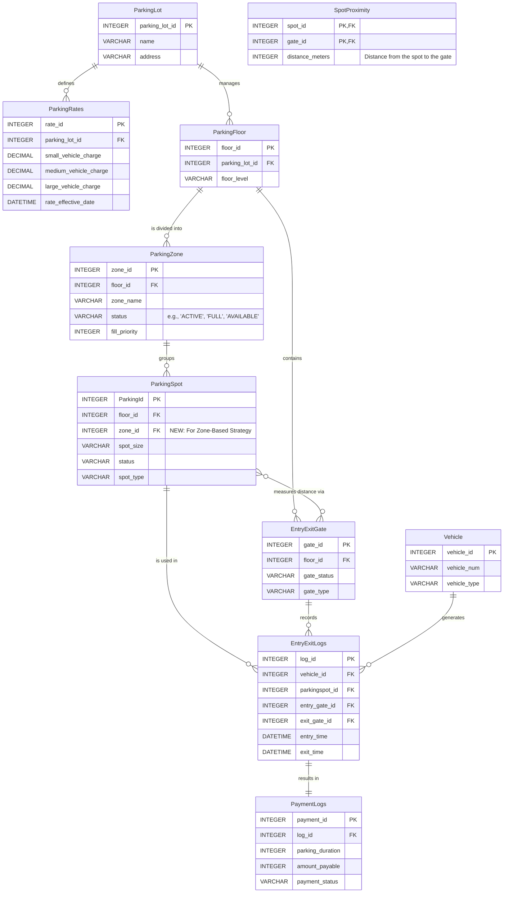
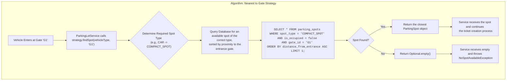
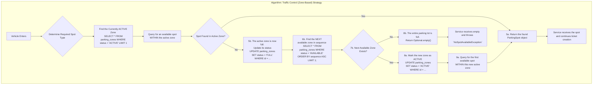
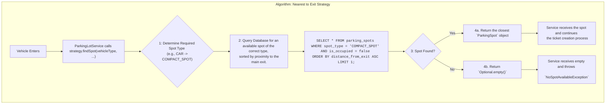

# Smart Parking Lot System - Backend Service

1.  [Introduction](#1-introduction)
2.  [System Overview](#2-system-overview)
    *   [Core Features](#core-features)
    *   [Technology Stack](#technology-stack)
3.  [Low-Level Design (LLD)](#3-low-level-design-lld)
    *   [Architectural Design](#architectural-design)
    *   [Data Model and Schema](#data-model-and-schema)
4.  [Spot Allocation Strategies & Algorithms](#spot-allocation-strategies--algorithms)
    *   [Nearest to Gate Strategy](#1-nearest-to-gate-strategy)
    *   [Traffic Control (Zone-Based) Strategy](#2-traffic-control-zone-based-strategy)
    *   [Nearest to Exit Strategy](#3-nearest-to-exit-strategy)
    *   [Fee Calculation Logic](#fee-calculation-logic)
5.  [Concurrency Management](#4-concurrency-management)
6.  [Component Design Details](#services-interfaces-and-enums)
    *   [Enumerations (Enums)](#1-enumerations-enums)
    *   [Core Strategy Interfaces](#2-core-strategy-interfaces)
    *   [Repository Interfaces](#3-repository-interfaces)
    *   [Service Layer (Business Logic)](#4-service-layer-business-logic)
7.  [API Endpoints (REST Contract)](#api-endpoints-rest-contract)
    *   [Public / Transactional API Endpoints](#public--transactional-api-endpoints)
    *   [Admin API Endpoints](#admin-api-endpoints)
8.  [Future Enhancements](#6-future-enhancements)
---

## 1. Introduction

This document outlines the low-level design and architecture for the backend system of a **Smart Parking Lot**. The system is designed to efficiently manage the entire lifecycle of a vehicle's stay in a multi-floor parking facility, from entry to exit. It provides a robust, scalable, and concurrent-safe solution for automated parking management.

The primary goal of this system is to automate parking spot allocation based on vehicle size, track vehicle duration, and calculate parking fees, all while maintaining a real-time view of the parking lot's occupancy.

## 2. System Overview

### Core Features

*   **Automated Spot Allocation:** Dynamically assigns the first available parking spot that fits the vehicle's size (Motorcycle, Car, Bus/Truck).
*   **Check-In/Check-Out:** Records precise entry and exit timestamps for every vehicle, creating an immutable parking ticket record.
*   **Dynamic Fee Calculation:** Calculates parking fees based on the duration of the stay and pre-configured hourly rates for different vehicle types.
*   **Real-Time Occupancy Tracking:** The availability of every parking spot is updated in real-time, ensuring the system state is always consistent.
*   **RESTful API:** Exposes a clean, simple set of HTTP endpoints for interaction with the system (e.g., from an entry gate terminal or a mobile app).

### Technology Stack

| Component              | Technology / Framework       | Rationale                                                                        |
| ---------------------- | ---------------------------- | -------------------------------------------------------------------------------- |
| **Backend Framework**  | Spring Boot 3.x (Java 17+)   | Rapid development, dependency injection, robust ecosystem, embedded web server.  |
| **Data Access**        | Spring Data JPA / Hibernate  | Simplifies database interactions, ORM for mapping objects to relational data.    |
| **Database**           | PostgreSQL (Production) / H2 (Dev) | A powerful, open-source relational database with strong support for transactions. |
| **API Specification**  | RESTful with JSON            | Industry standard for web services, easy to understand and consume.              |
| **Build Tool**         | Apache Maven                 | Manages project dependencies, builds, and packaging effectively.                 |

## 3. Low-Level Design (LLD)

### Architectural Design

The system is designed using a classic **3-Tier Layered Architecture**, which promotes separation of concerns and enhances maintainability. This is a standard and proven pattern for building enterprise-level applications with Spring Boot.

*   **Controller Layer (API):** The entry point for all external requests. Its sole responsibility is to handle HTTP requests, perform validation, and delegate the work to the Service layer. It is unaware of the business logic's complexity.
*   **Service Layer (Business Logic):** The core of the application. It contains all business logic, orchestrates data access operations, and ensures data integrity through transactions. It is completely decoupled from the web layer.
*   **Repository Layer (Data Access):** This layer is responsible for all communication with the database. It abstracts the data source and provides a clean API for the Service layer to perform CRUD operations.

The flow of a typical request is as follows:

```
[Client] -> [Controller] -> [Service] -> [Repository] -> [Database]
```

### Data Model and Schema

#### Entity-Relationship (ER) Diagram

The following diagram illustrates the relationships between the core entities in the system.


*(Note: Table and column names in the final implementation may use snake_case for SQL compatibility.)*

# Spot Allocation Strategies
### 1. Nearest to Gate Strategy



### 2. Traffic Control (Zone-Based) Strategy



### 3. Nearest to Exit Strategy



#### Fee Calculation Logic

The fee calculation is centralized in the `FeeCalculationService`.

1.  **Retrieve Ticket:** The active `ParkingTicket` is retrieved from the database.
2.  **Calculate Duration:** The duration is calculated as `(current_time - entry_time)`.
3.  **Round Up Hours:** The duration is converted to hours and rounded up to the next whole hour (e.g., 2 hours and 15 minutes becomes 3 hours). A minimum of 1 hour is charged.
4.  **Apply Rate:** The system retrieves the hourly rate corresponding to the `VehicleType` from the `ParkingRates` configuration.
5.  **Calculate Total:** The final fee is calculated as `(hours * hourly_rate)`.

## 4. Concurrency Management

Handling simultaneous requests is critical for a parking system. The most significant challenge is the **race condition** where two or more vehicles attempt to claim the last available parking spot at the same time.

**Problem:**
1.  Thread A reads the database and finds Spot #123 is available.
2.  Before Thread A can update the spot, Thread B reads the database and also finds Spot #123 is available.
3.  Both threads attempt to assign the same spot, leading to data inconsistency.

**Solution: Pessimistic Locking**

To prevent this, the system employs a **pessimistic locking** strategy at the database level.

*   **Implementation:** The `findFirstBySpotTypeAndIsOccupiedFalse(...)` method in the `ParkingSpotRepository` is annotated with `@Lock(LockModeType.PESSIMISTIC_WRITE)`.
*   **Mechanism:** This annotation instructs JPA to issue a `SELECT ... FOR UPDATE` SQL statement. The database places a lock on the row as soon as it is read, preventing any other transaction from reading or modifying it until the first transaction completes.
*   **Rationale:** While pessimistic locking can reduce throughput compared to optimistic locking, it is the safest and simplest strategy for this high-contention, critical operation. It guarantees that spot allocation is a serialized and atomic process, eliminating the race condition entirely.

# Services, Interfaces, and Enums

This document details the software components for the Smart Parking Lot system, including the definitions for services, strategic interfaces, and core enumerations. This serves as a contract for the business logic layer.

## 1. Enumerations (Enums)

Enums are used throughout the system to provide type-safety and a fixed set of allowed values for key attributes, preventing magic strings and ensuring data integrity.

### VehicleType
Defines the types of vehicles the system can handle.
*   `MOTORCYCLE`: For two-wheeled vehicles.
*   `CAR`: For standard compact and sedan cars.
*   `TRUCK`: For larger vehicles like SUVs, trucks, or buses.

### ParkingSpotType
Defines the types of parking spots available, corresponding to vehicle types.
*   `MOTORCYCLE_SPOT`: A small spot designed for motorcycles.
*   `COMPACT_SPOT`: A standard-sized spot for cars.
*   `LARGE_SPOT`: A large spot for trucks and oversized vehicles.

### PaymentStatus
Tracks the status of a payment transaction.
*   `PENDING`: The payment has been initiated but not yet confirmed.
*   `SUCCESSFUL`: The payment was successfully processed.
*   `FAILED`: The payment processing failed.

### GateType
Specifies the function of a gate.
*   `ENTRY`: The gate is used only for vehicle entry.
*   `EXIT`: The gate is used only for vehicle exit.
*   `ENTRY_EXIT`: The gate can be used for both entry and exit.

### GateStatus
Represents the operational status of a gate.
*   `OPERATIONAL`: The gate is fully functional.
*   `UNDER_MAINTENANCE`: The gate is temporarily out of service.

### ZoneStatus
Represents the status of a `ParkingZone` for the traffic control allocation strategy.
*   `ACTIVE`: The zone is currently being filled with vehicles.
*   `FULL`: The zone has no available spots.
*   `AVAILABLE`: The zone is not yet active but has spots available.

---

## 2. Core Strategy Interfaces

These interfaces define contracts for pluggable business logic, adhering to the Strategy Design Pattern and the Open/Closed Principle.

### SpotAllocationStrategy (Interface)
Defines the contract for all parking spot allocation algorithms. The system can be configured to use any class that implements this interface.

*   **`findSpot(vehicleType, entryGateId)`**
    *   **Description:** Finds the best available parking spot based on the specific strategy's logic.
    *   **Parameters:**
        *   `vehicleType (VehicleType)`: The type of vehicle that needs a spot.
        *   `entryGateId (String)`: The unique identifier of the gate the vehicle entered through.
    *   **Returns:** A `ParkingSpot` object or `null` if no suitable spot is available.

### PaymentGateway (Interface)
Defines the contract for an external payment processor, abstracting the system from any specific payment provider (e.g., Stripe, PayPal).

*   **`processPayment(amount, paymentDetails)`**
    *   **Description:** Processes a payment transaction.
    *   **Parameters:**
        *   `amount (BigDecimal)`: The total amount to be charged.
        *   `paymentDetails (PaymentDetails)`: An object containing payment information (e.g., credit card token, customer info).
    *   **Returns:** A `TransactionResult` object containing the `PaymentStatus` and a unique `transactionId`.


## 3. Repository Interfaces

### ParkingLotRepository
*   **Purpose:** To manage the top-level `ParkingLot` entities. This is crucial for a system designed to potentially handle multiple parking facilities.
*   **Key Methods:**
    *   `findById(parkingLotId)`
    *   `findByName(name)`

### ParkingFloorRepository
*   **Purpose:** To manage the floor entities within a parking lot.
*   **Key Methods:**
    *   `findByParkingLotId(parkingLotId)`
    *   `findById(floorId)`

### ParkingZoneRepository
*   **Purpose:** Essential for the **Traffic Control** allocation strategy. Manages the lifecycle and status of parking zones.
*   **Key Methods:**
    *   `findActiveZoneByFloorId(floorId)`
    *   `findNextAvailableZoneByPriority(floorId, currentPriority)`
    *   `save(parkingZone)`

### ParkingSpotRepository
*   **Purpose:** The most critical repository for the core parking logic. It handles finding available spots based on various complex criteria defined by the allocation strategies.
*   **Key Methods:**
    *   `findAndLockAvailableSpotInZone(spotType, zoneId)` *(with Pessimistic Lock)*
    *   `findAndLockAvailableSpotNearestToGate(spotType, gateId)` *(with Pessimistic Lock)*
    *   `findAndLockAvailableSpotNearestToExit(spotType, exitGateId)` *(with Pessimistic Lock)*
    *   `findById(spotId)`
    *   `save(parkingSpot)`

### EntryExitGateRepository
*   **Purpose:** To manage and validate the gates of the parking lot. The service layer would use this to confirm that a gate ID from a request is valid and operational.
*   **Key Methods:**
    *   `findByIdAndStatus(gateId, status)`
    *   `findByFloorId(floorId)`

### ParkingRatesRepository
*   **Purpose:** Crucial for the `FeeCalculationService`. This repository fetches the correct pricing rules for a given parking lot and time.
*   **Key Methods:**
    *   `findActiveRateByLotId(parkingLotId, currentTime)`
    *   `save(parkingRates)`

### VehicleRepository
*   **Purpose:** To manage vehicle information. While not strictly necessary for a simple "pay-by-plate" system, it's essential for future features like registered users, monthly passes, or tracking vehicle history.
*   **Key Methods:**
    *   `findByLicenseNumber(licenseNumber)`
    *   `save(vehicle)`

### ParkingTicketRepository (or EntryExitLogsRepository)
*   **Purpose:** Manages the primary transactional entity of the system: the parking ticket or log.
*   **Key Methods:**
    *   `findActiveTicketById(ticketId)`
    *   `findActiveTicketByLicenseNumber(licenseNumber)`
    *   `findTicketsWithinDateRange(startDate, endDate)`
    *   `save(parkingTicket)`

### PaymentRepository (or PaymentLogsRepository)
*   **Purpose:** To manage the financial records associated with parking tickets. Used for auditing, refunds, and reporting.
*   **Key Methods:**
    *   `findByTicketId(ticketId)`
    *   `findPaymentsByStatus(paymentStatus)`
    *   `save(payment)`


## 4. Service Layer (Business Logic)

The service layer contains the core application logic, with each service adhering to the Single Responsibility Principle.
### Core Transactional Services

These services manage the primary, day-to-day workflow of the parking lot.

#### 1. `ParkingLotService` (Facade)
Acts as the central orchestrator for the main parking workflow. It is the primary entry point for the controllers and coordinates the actions of other services and repositories.

*   **`handleVehicleEntry(vehicleType, licenseNumber, entryGateId)`**
    *   **Description:** Manages the complete process of a vehicle entering the lot. This is a high-level transactional method.
    *   **Logic:**
        1.  Calls the configured `SpotAllocationStrategy` to find an available spot.
        2.  Throws an exception if no spot is found.
        3.  Calls `OccupancyService` to mark the spot as occupied.
        4.  Creates a new `ParkingTicket` record and saves it.
    *   **Returns:** The newly created `ParkingTicket`.

*   **`handleVehicleExit(ticketId, paymentDetails)`**
    *   **Description:** Manages the vehicle exit process. This is a high-level transactional method.
    *   **Logic:**
        1.  Retrieves the active `ParkingTicket`.
        2.  Calls `PaymentService` to process the payment for the ticket.
        3.  If payment is successful, it updates the `ParkingTicket` with exit time and status.
        4.  Calls `OccupancyService` to free the parking spot.
    *   **Returns:** The updated, closed `ParkingTicket`.

#### 2. `FeeCalculationService`
Encapsulates all logic for calculating parking fees, strictly adhering to the Single Responsibility Principle.

*   **`calculateFee(ticket)`**
    *   **Description:** Calculates the total parking fee for a given ticket.
    *   **Logic:**
        1.  Calculates the duration of the stay (exit time - entry time).
        2.  Rounds the duration up to the nearest hour.
        3.  Fetches the active hourly rate for the vehicle's type from the `ParkingRatesRepository`.
        4.  Returns `(duration in hours * hourly rate)`.
    *   **Returns:** The calculated fee as a `BigDecimal`.

#### 3. `PaymentService`
Responsible for all interactions with the payment system.

*   **`processPaymentForTicket(ticket, paymentDetails)`**
    *   **Description:** Orchestrates the payment for a ticket.
    *   **Logic:**
        1.  Calls `FeeCalculationService` to determine the final amount.
        2.  Interacts with the `PaymentGateway` interface to process the transaction.
        3.  Creates and saves a `PaymentLog` record with the transaction result (`SUCCESSFUL` or `FAILED`).
    *   **Returns:** The created `PaymentLog` object.

#### 4. `OccupancyService`
Manages the state of the physical parking infrastructure (spots and zones).

*   **`occupySpot(spotId, ticketId)`**
    *   **Description:** Marks a spot as occupied.
    *   **Logic:**
        1.  Finds the `ParkingSpot` by its ID.
        2.  Updates its status to `OCCUPIED`.
        3.  Updates any relevant zone or floor-level occupancy counters.
    *   **Returns:** The updated `ParkingSpot`.

*   **`freeSpot(spotId)`**
    *   **Description:** Marks a spot as vacant.
    *   **Logic:**
        1.  Finds the `ParkingSpot` by its ID.
        2.  Updates its status to `VACANT`.
        3.  Updates any relevant zone or floor-level occupancy counters.
    *   **Returns:** The updated `ParkingSpot`.

### Administrative & Operational Services

These services are used by system administrators to configure, manage, and get insights from the parking lot. They would likely be exposed via a separate, secured set of API endpoints.

#### 5. `ParkingLotAdminService`
Handles the setup and physical configuration of the parking lot.

*   **`addFloor(parkingLotId, floorLevel)`**
    *   **Description:** Adds a new floor to an existing parking lot.
*   **`addZone(floorId, zoneName, fillPriority)`**
    *   **Description:** Adds a new parking zone to a floor.
*   **`addParkingSpot(floorId, zoneId, spotType)`**
    *   **Description:** Adds a new parking spot to a zone.
*   **`addGate(floorId, gateType)`**
    *   **Description:** Adds a new entry or exit gate to a floor.
*   **`updateGateStatus(gateId, newStatus)`**
    *   **Description:** Changes the operational status of a gate (e.g., to `UNDER_MAINTENANCE`).
*   **`defineSpotProximity(spotId, gateId, distance)`**
    *   **Description:** Configures the distance between a spot and a gate, populating the `SpotProximity` table for proximity-based allocation strategies.

#### 6. `ParkingRateAdminService`
Provides dedicated functionality for managing the pricing rules of the system.

*   **`setNewRates(parkingLotId, newRates)`**
    *   **Description:** Sets a new set of hourly charges for a parking lot, with a specific effective date.
    *   **Logic:** Creates a new record in the `ParkingRates` table.
*   **`getRateHistory(parkingLotId)`**
    *   **Description:** Retrieves a list of all historical and future pricing rules for a lot.

#### 7. `ReportingService`
Provides methods to extract business intelligence and operational data from the system.

*   **`generateDailyRevenueReport(date, parkingLotId)`**
    *   **Description:** Calculates the total revenue for a specific day.
    *   **Logic:** Aggregates data from the `PaymentLogs` table.
*   **`getOccupancyStatistics(dateRange, parkingLotId)`**
    *   **Description:** Provides statistics on parking lot usage, such as peak hours, average duration of stay, and usage by vehicle type.
    *   **Logic:** Aggregates data from the `EntryExitLogs` table.
*   **`getCurrentOccupancy()`**
    *   **Description:** Returns a real-time overview of the parking lot's status, including total occupied spots, available spots per vehicle type, and active zone.


### Public / Transactional API Endpoints

These endpoints handle the primary, real-time workflow of vehicles entering and exiting the parking lot. They are intended to be called by automated systems like entry/exit gate terminals or customer-facing mobile applications.

#### **POST** `/api/v1/parking/entry`
*   **Description:** The primary endpoint for initiating a parking session when a vehicle enters the lot.
*   **Request Body:**
    ```json
    {
      "licenseNumber": "CA-123-XYZ",
      "vehicleType": "CAR",
      "entryGateId": "GATE-01A"
    }
    ```
*   **Success Response (201 CREATED):**
    ```json
    {
      "ticketId": "a1b2c3d4-e5f6-7890-1234-567890abcdef",
      "spotId": "C-05",
      "entryTime": "2025-09-16T18:30:00Z",
      "status": "ACTIVE"
    }
    ```
*   **Error Responses:**
    *   `400 BAD REQUEST`: If the request body is invalid or a required field is missing.
    *   `503 SERVICE UNAVAILABLE`: If no parking spots are available for the requested vehicle type.

#### **POST** `/api/v1/parking/exit/{ticketId}`
*   **Description:** Handles the vehicle exit process, including fee calculation and payment.
*   **URL Parameter:**
    *   `ticketId` (string, UUID): The unique identifier of the parking ticket.
*   **Request Body:**
    ```json
    {
      "paymentDetails": {
        "method": "CREDIT_CARD",
        "cardToken": "tok_1M3x..." 
      }
    }
    ```
*   **Success Response (200 OK):**
    ```json
    {
      "ticketId": "a1b2c3d4-e5f6-7890-1234-567890abcdef",
      "exitTime": "2025-09-16T20:45:10Z",
      "amountPaid": 30.00,
      "paymentStatus": "SUCCESSFUL"
    }
    ```
    **Error Responses:**
    *   `402 PAYMENT REQUIRED`: If the payment processing fails.
    *   `404 NOT FOUND`: If the `ticketId` is invalid or the ticket is not active.

#### **GET** `/api/v1/parking/occupancy`
*   **Description:** Provides a real-time, public-facing summary of the parking lot's current availability. This can be used to power digital signs at the entrance.
*   **Success Response (200 OK):**
    ```json
    {
      "totalSpots": 500,
      "occupiedSpots": 450,
      "availableSpots": 50,
      "availabilityByType": {
        "MOTORCYCLE_SPOT": 10,
        "COMPACT_SPOT": 35,
        "LARGE_SPOT": 5
      },
      "lotStatus": "LIMITED_SPOTS" // e.g., AVAILABLE, LIMITED_SPOTS, FULL
    }
    ```

---

### Admin API Endpoints

These endpoints are for administrative and operational purposes. They must be secured and accessible only to authorized personnel (e.g., parking lot managers). A base path like `/api/v1/admin` is used to group them.

#### Parking Lot Configuration
*   **POST** `/api/v1/admin/lots/{lotId}/floors`
    *   **Description:** Adds a new floor to the parking lot.
    *   **Request Body:** `{ "floorLevel": "P3", "totalSpots": 100 }`
*   **POST** `/api/v1/admin/floors/{floorId}/zones`
    *   **Description:** Adds a new zone to a floor.
    *   **Request Body:** `{ "zoneName": "Zone C", "fillPriority": 3 }`
*   **POST** `/api/v1/admin/zones/{zoneId}/spots`
    *   **Description:** Adds a new parking spot to a zone.
    *   **Request Body:** `{ "spotType": "COMPACT_SPOT", "spotIdentifier": "C-25" }`
*   **POST** `/api/v1/admin/floors/{floorId}/gates`
    *   **Description:** Adds a new gate to a floor.
    *   **Request Body:** `{ "gateIdentifier": "EXIT-02B", "gateType": "EXIT" }`
*   **PUT** `/api/v1/admin/gates/{gateId}/status`
    *   **Description:** Updates the operational status of a gate.
    *   **Request Body:** `{ "status": "UNDER_MAINTENANCE" }`
*   **POST** `/api/v1/admin/proximity`
    *   **Description:** Defines the distance between a spot and a gate for proximity-based allocation.
    *   **Request Body:** `{ "spotId": "SPOT-123", "gateId": "GATE-01A", "distanceMeters": 50 }`

#### Pricing Management
*   **POST** `/api/v1/admin/lots/{lotId}/rates`
    *   **Description:** Sets a new pricing scheme for a parking lot, which will become active on the specified date.
    *   **Request Body:**
        ```json
        {
          "smallVehicleCharge": 6.00,
          "mediumVehicleCharge": 12.00,
          "largeVehicleCharge": 18.00,
          "rateEffectiveDate": "2026-01-01T00:00:00Z"
        }
        ```
*   **GET** `/api/v1/admin/lots/{lotId}/rates`
    *   **Description:** Retrieves the history of all pricing schemes for a parking lot.

#### Reporting & Monitoring
*   **GET** `/api/v1/admin/reports/revenue`
    *   **Description:** Generates a revenue report for a given date range.
    *   **Query Parameters:** `?startDate=2025-09-15&endDate=2025-09-16`
    *   **Success Response (200 OK):** `{ "totalRevenue": 15240.50, "totalTransactions": 980 }`
*   **GET** `/api/v1/admin/reports/occupancy`
    *   **Description:** Generates a historical occupancy report to identify trends.
    *   **Query Parameters:** `?startDate=2025-09-01&endDate=2025-09-15`
    *   **Success Response (200 OK):** `{ "averageOccupancy": "85%", "peakHour": "11:00 AM", ... }`
*   **GET** `/api/v1/admin/tickets`
    *   **Description:** Retrieves a list of parking tickets with optional filtering.
    *   **Query Parameters:** `?status=ACTIVE`, `?licenseNumber=CA-123-XYZ`
    *   **Success Response (200 OK):** A paginated list of `ParkingTicket` objects.


## 6. Future Enhancements

The current design provides a solid foundation for future expansion. Potential enhancements include:
*   **Parking Reservations:** Allow users to reserve a parking spot in advance.
*   **Advanced Pricing Models:** Implement flexible pricing strategies (e.g., different rates for weekends/holidays, progressive pricing based on duration).
*   **Payment Gateway Integration:** Integrate with services like Stripe or PayPal for real-time payment processing.
*   **Multi-Lot Management:** Extend the data model to manage multiple parking lot locations from a single system.
*   **User Accounts:** Introduce user roles for customers and administrators.
*   **Real-time Dashboard:** Create a frontend dashboard to visualize parking lot occupancy and statistics.
